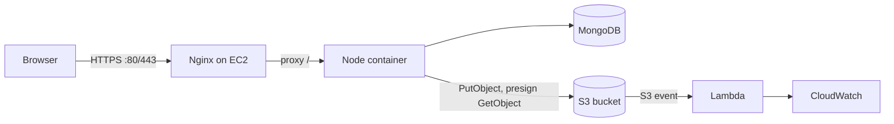

# Smart File Share

file-sharing
A small, **production-style** web application: users upload files through a React UI, the **Node.js + Express** API stores bytes in **Amazon S3** and metadata in **MongoDB**, and downloads use **short-lived pre-signed URLs** (private bucket, no direct public listing).

This repo is meant for **learning DevOps on AWS**: Docker, Nginx reverse proxy, EC2 deploy, S3 + Lambda + CloudWatch, and a **GitHub Actions** pipeline that builds the app and deploys over **SSH**.

---

## What you get

| Piece | Role |
|--------|------|
| **React (Vite)** | Upload form, file list, “Open download” using pre-signed GET URLs |
| **Express** | `/api/files` upload, list, metadata, pre-sign for download |
| **MongoDB** | Document per file: name, size, S3 key, optional expiry, user label |
| **S3** | Object storage; only the API can write; users download via pre-signed URL |
| **Nginx (on EC2)** | Optional reverse proxy, TLS, body size for uploads |
| **Lambda (example)** | Triggered on S3 `ObjectCreated` — logs to **CloudWatch** |
| **Docker / Compose** | One image runs API + static UI; Compose adds Mongo for dev |



---

## Project layout

```
.
├── backend/                 # Express API (ES modules)
│   └── src/
│         app.js
│         server.js
│         routes/files.js
│         services/s3Service.js
│         models/FileRecord.js
├── frontend/                # Vite + React
├── lambda/s3-logger/        # Example: S3 create → log (zip for AWS)
├── nginx/default.conf      # Site config for Ubuntu EC2
├── scripts/deploy.sh        # Server-side pull + `docker compose up`
├── Dockerfile
├── docker-compose.yml
├── .env.example
└── .github/workflows/deploy.yml
```

---

## Prerequisites

- **Node.js 20+** and **npm** (local dev)
- **Docker** and **Docker Compose** (container run)
- An **AWS account** (S3, optional EC2 + Lambda)
- A **MongoDB** URI (local container, self-hosted, or [MongoDB Atlas](https://www.mongodb.com/cloud/atlas))
- (Optional) **GitHub** for Actions; an **EC2** instance with your SSH key

---

## 1) Configure environment

Copy the example file and edit values (never commit real secrets).

```bash
cp .env.example .env
```

| Variable | Meaning |
|----------|--------|
| `MONGODB_URI` | e.g. `mongodb://mongo:27017/smartfile` with Compose, or Atlas URI |
| `AWS_REGION` | e.g. `us-east-1` |
| `S3_BUCKET` | Globally unique bucket name you create in AWS |
| `AWS_ACCESS_KEY_ID` / `AWS_SECRET_ACCESS_KEY` | For development or IAM user; on EC2 prefer an **instance role** and omit these |

---

## 2) Local development (no Docker for Node)

1. **Start MongoDB** (if not using Atlas), e.g. with Docker:  
   `docker run -d -p 27017:27017 --name local-mongo mongo:7`  
2. Set `MONGODB_URI=mongodb://127.0.0.1:27017/smartfile` in `.env` at the repo root (or `backend/.env` — the loader checks both).  
3. **Backend** (from repo root):

   ```bash
   cd backend
   npm install
   npm run dev
   ```

4. **Frontend** (second terminal):

   ```bash
   cd frontend
   npm install
   npm run dev
   ```

5. Open **http://127.0.0.1:5173** — Vite proxies `/api` to the API on port **3000**.  
6. For uploads to work, you must configure **S3** and valid AWS credentials (see below).

**API health check:** `GET http://127.0.0.1:3000/api/health`

**Note (multi-user simulation):** the UI sets a “Session label” stored in the browser. It is sent as the header `X-User-Label` so file lists are scoped. This is **not** a substitute for real authentication.

---

## 3) Run with Docker Compose

With `.env` filled (at least `MONGODB_URI` for the compose default and S3 + AWS):

```bash
docker compose --env-file .env up --build -d
```

- App: **http://127.0.0.1:3000** (UI + API same origin)  
- Mongo: `27017` on the host (see `docker-compose.yml`)

Check logs: `docker compose logs -f app`

---

## 4) AWS: S3 bucket and IAM (minimal)

### Create the bucket

1. AWS Console → **S3** → **Create bucket**.  
2. Choose a **unique** name (e.g. `my-team-smartfile-2026`).  
3. Region: match `AWS_REGION` in `.env`.  
4. **Block Public Access** can stay **on** (recommended) — we use pre-signed URLs, not a public bucket.  
5. For learning, default encryption (SSE-S3) is enough.

### IAM policy for the app

Attach a policy like this to the user or instance role the API uses (replace `BUCKET` and `REGION`):

```json
{
  "Version": "2012-10-17",
  "Statement": [
    {
      "Sid": "SmartFileS3",
      "Effect": "Allow",
      "Action": [
        "s3:PutObject",
        "s3:GetObject",
        "s3:DeleteObject"
      ],
      "Resource": "arn:aws:s3:::BUCKET/*"
    }
  ]
}
```

**On EC2**, create an **IAM role** with this policy, attach the role to the instance, and **remove** long-lived `AWS_ACCESS_KEY_ID` from `.env` so the AWS SDK uses the instance metadata automatically.

---

## 5) AWS: Lambda + S3 event + CloudWatch

Goal: when a new object is created, Lambda runs and writes a line to **CloudWatch Logs** (auditing / learning hook).

1. In **Lambda**, create a function, runtime **Node.js 20.x**.  
2. Paste or upload the code in `lambda/s3-logger/index.mjs` (or zip it — see `lambda/s3-logger/README.md`).  
3. **Handler** for ESM: `index.handler` (export name `handler`).  
4. Add trigger: **S3** → your bucket → event type **All object create events**; optional prefix `uploads/`.  
5. **Permissions**: default Lambda role already allows writing to CloudWatch **Logs** for the function.  
6. After an upload, open **CloudWatch** → **Log groups** → `/aws/lambda/<function-name>` and search for the JSON log line with `S3 object created`.

---

## 6) EC2 (Ubuntu) + Nginx + Docker (step-by-step)

These steps put **Nginx** on the host and the **app in Docker** (common pattern).

### 6.1 Launch EC2

1. **EC2** → **Launch instance**: Ubuntu 22.04/24.04, `t3.small` or similar.  
2. **Key pair**: create or use an existing `.pem` for SSH.  
3. **Security group**: allow **22** (SSH) from *your* IP, **80** and **443** from the internet (or your VPN). You can open **3000** only for debugging.  
4. **Storage**: 20+ GiB is usually enough.  
5. **IAM instance role**: attach the role with S3 access (recommended).  
6. **Elastic IP** (optional): allocate and associate a static public IP.  
7. **SSH in**:

   ```bash
   ssh -i /path/to/key.pem ubuntu@YOUR_PUBLIC_IP
   ```

### 6.2 Install Docker on the instance

```bash
sudo apt update && sudo apt install -y ca-certificates curl gnupg
sudo install -m 0755 -d /etc/apt/keyrings
curl -fsSL https://download.docker.com/linux/ubuntu/gpg | sudo gpg --dearmor -o /etc/apt/keyrings/docker.gpg
echo "deb [arch=$(dpkg --print-architecture) signed-by=/etc/apt/keyrings/docker.gpg] https://download.docker.com/linux/ubuntu $(. /etc/os-release && echo ${VERSION_CODENAME}) stable" | sudo tee /etc/apt/sources.list.d/docker.list > /dev/null
sudo apt update
sudo apt install -y docker-ce docker-ce-cli containerd.io docker-compose-plugin
sudo usermod -aG docker $USER
# log out and back in so "docker" works without sudo
```

### 6.3 Put the project on the server

Option A — **git clone** (if the repo is on GitHub):

```bash
cd ~
git clone https://github.com/YOU/smart-file-share.git
cd smart-file-share
cp .env.example .env
nano .env   # set MONGODB_URI, S3, region; on EC2 with IAM role, omit static AWS keys
```

For Mongo, either point `MONGODB_URI` to **Atlas** or add Mongo in `docker-compose` on the same host (already in this repo for Compose).

Option B — **rsync/SCP** from your laptop (same as CI does).

Build and start:

```bash
docker compose --env-file .env up --build -d
curl -s http://127.0.0.1:3000/api/health
```

### 6.4 Nginx reverse proxy

1. `sudo apt install -y nginx`  
2. Copy `nginx/default.conf` from this repo to `/etc/nginx/sites-available/smart-file-share` and adjust `server_name` to your **domain** or keep `_` for a quick test.  
3. Enable the site and disable the default if needed:

   ```bash
   sudo ln -sf /etc/nginx/sites-available/smart-file-share /etc/nginx/sites-enabled/
   sudo rm -f /etc/nginx/sites-enabled/default
   sudo nginx -t && sudo systemctl reload nginx
   ```

4. Browse to `http://YOUR_PUBLIC_IP` — traffic goes **Nginx → 127.0.0.1:3000 → Docker app**.

### 6.5 HTTPS (recommended)

On the server, install [Certbot](https://certbot.eff.org/) for Nginx, obtain a certificate for your domain, and follow the commented **443** block in `nginx/default.conf` (or let Certbot modify the config).

---

## 7) CloudWatch and application logs

- **Lambda** logs: automatic under `/aws/lambda/<name>`.  
- **App on Docker** (Node): `docker compose logs -f app` on EC2, or use the [CloudWatch agent](https://docs.aws.amazon.com/AmazonCloudWatch/latest/monitoring/Install-CloudWatch-Agent.html) to ship file logs to a **log group** (optional extension for students).

---

## 8) GitHub Actions CI/CD

The workflow **`.github/workflows/deploy.yml`** runs on pushes to `main` (and can be run manually with **Run workflow**).

1. **Build job**: `npm install` in `backend` and `frontend`, then `npm run build` in `frontend`.  
2. **Deploy job** (if secrets are set): `rsync` the repo to EC2, then `docker compose build && up -d`.

**Repository secrets** (Settings → Secrets and variables → Actions):

| Secret | Description |
|--------|-------------|
| `EC2_SSH_KEY` | Full private key (PEM) for SSH |
| `EC2_HOST` | Public DNS or IP of the instance |
| `EC2_USER` | e.g. `ubuntu` |
| `DEPLOY_DIR` | (Optional) absolute path on the server, e.g. `/home/ubuntu/smart-file-share` |

**Before the first deploy**, create `/home/<user>/smart-file-share` (or your `DEPLOY_DIR`) and a **`.env`** on the server with real values — the workflow does not commit secrets.

If secrets are missing, the **build still runs**; deploy steps are skipped with a message.

**Server script:** `scripts/deploy.sh` is an alternative: clone/pull on the instance and `docker compose up` (set `DEPLOY_DIR`, optional `REPO_URL`).

---

## 9) API summary

| Method | Path | Description |
|--------|------|-------------|
| `GET` | `/api/health` | Liveness |
| `GET` | `/api/files` | List files for `X-User-Label` (default `default`) |
| `POST` | `/api/files/upload` | Multipart form: field `file`, optional `expiresInDays` |
| `GET` | `/api/files/:id` | Metadata |
| `GET` | `/api/files/:id/presign` | JSON with short-lived S3 pre-signed `url` and `originalName` |

**Upload body:** `multipart/form-data` with one file field `file`.  
**Expiry:** if `expiresInDays` is set, the API stores `expiresAt` and the **pre-sign** endpoint returns **410** after that time.

---

## 10) Security notes (read before production)

- Add **real authentication** (session, JWT, or OIDC) if the app is public.  
- Prefer **IAM roles on EC2** over static `AWS_ACCESS_KEY_ID` in files.  
- **Rotate** presigned URL expiry (`getPresignedDownloadUrl` in `s3Service.js`) to match your UX.  
- **Rate limit** and **scan** uploads for malware if you accept arbitrary files.  
- Keep **Nginx** and the OS **patched**; use **TLS** for all browser traffic.

---

## 11) Troubleshooting

| Symptom | What to check |
|--------|----------------|
| `AccessDenied` on S3 | IAM policy, bucket name, region, or wrong credentials/role |
| Upload works but download fails | Clock skew, object key, or presign expiry; check bucket still has the object |
| 502 from Nginx | `docker ps`, `curl 127.0.0.1:3000/api/health` on the server |
| Empty file list | `X-User-Label` matches what you used when uploading |
| Mongo connection error | `MONGODB_URI`, security groups if Atlas, or `mongo` container health in Compose |

---

## License

Use this project for **education and experimentation**. There is no warranty; harden and own your deployment before using with sensitive data.
